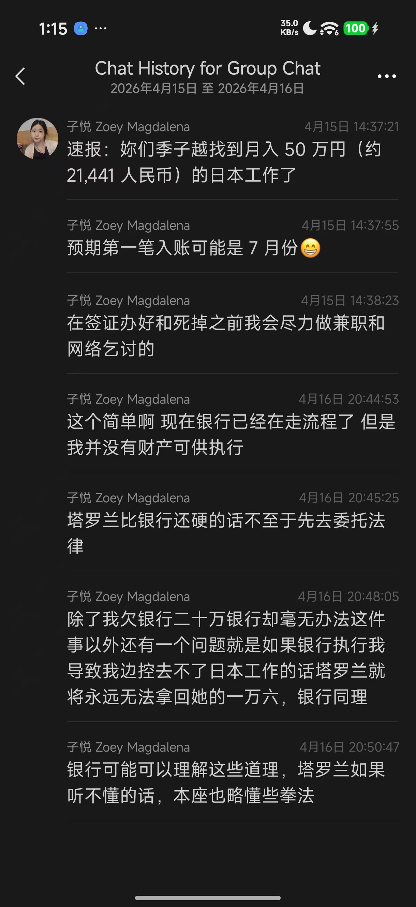

昨天，我在OAU和清蒸都看到了塔罗兰的死讯，我试着去联系她的微信，对方说人已经离世。虽然我不知道微信对面回复的人是谁，但塔罗兰的死亡应该已经是事实。我与塔罗兰相识了几年，尽管并非挚友，但还是感到震惊。云依曾说对mtf来说朋友离世很常见，但我没有想到我的熟人中第一个死去的，却是由于这样的原因。在我看来，塔罗兰精神比较健康，一直有稳定的工作。在和季子越等人的冲突后，虽然非常愤慨和悲伤，但塔罗兰在群里也经常聊一些与与此无关的积极的生活。我本以为此事已经得以解决，或她已经从冲击中渐渐走出来，没想到真的就这样死去了。

我愤怒地发现，季子越等人试图以纪念的名义实施报复，将冲突的责任全部推给死者，并继续破坏死者的名誉。正好，由于我认识死者，且塔罗兰曾经与我谈过相关经历，我有必要在这里加以澄清。我需要指出，下面的部分内容基于塔罗兰的单方面叙事，除了季子越欠钱不还并威胁塔罗兰的事情（见后文）有明确证据外，其他的都并无对证。我也不对其真实性负责。我只是认为有必要听到另一方的声音——听到死者的声音。并为塔罗兰在死后继续受到不合理的攻击申辩。

 

今年（2026）上半年的时候，塔罗兰曾向我和其他人求助，说自己受到了本地酷儿社群的霸凌。根据塔罗兰的叙述，与她起冲突的人曾经被其他人围堵过，因此可能有PTSD，在肢体接触的时候触发了对方的创伤。后来对方声称塔罗兰试图强吻自己。由于对方在本地酷儿社群中有更多的好友和影响力，并与本地酷儿社群运营者关系匪浅，其好友基于个人关系而信赖对方并攻击塔罗兰，甚至用公号发表过批评塔罗兰的内容。尽管塔罗兰试图向运营者抗议，但据她所说，本地社群的运营者拉偏架，甚至将其诉求说成是作是「占用公共空间」。

在塔罗兰看来，虽然她不承认「强吻」的指控，但肢体接触引发了冲突的确是事实。然而，在事发后却出现了对她的其他附加攻击，例如，季子越本来与此事无关，但由于与涉事方的私交，季子越却造谣说塔罗兰试图和自己发生插入式性行为，并造谣说塔罗兰要砍人作为复仇。塔罗兰说，自己因为受到孤立、忽视、攻击和造谣，所以愤慨而抑郁，加之事情主要发生在性少数社群中，也不敢去找心理咨询。她多次想到或尝试自杀。而今这成为了事实。

 

在此事事发前，塔罗兰和季子越还是好友的时候，由于季子越失业而塔罗兰有工作，塔罗兰曾向季子越借出一万六千元钱以供季子越生活。但在事发后，季子越却以自己没钱且关系破裂为由，不仅拒绝偿还，并且对塔罗兰做出人身威胁。二人之间其他的冲突可能都没有足够明确的证据，但唯有欠款不还和威胁对方的事情是千真万确。我曾将相关聊天记录给朋友看过，她说，先无论季子越在观点和言论上的争议，首先就是一个人品极差的人。

 

说到这里，朋友们可能想知道是否有一个以塔罗兰的视角和立场讲述的完整的故事。很遗憾，我无从提供这个故事，而且由于死无对证，可能这个故事朋友们永远也听不到了。塔罗兰向我求助时，我给出的建议是让她把自己视角的事情经过写下来，并承诺如果她写了下来，我会尽可能帮助她传播。塔罗兰说自己的状态很难认真写作，但会尝试。此外我还建议就季子越的欠款问题寻求律师帮助。但在此之后，塔罗兰再没有就此事联系过我，大概她从未写成这个故事，而我也没有就此事再联系她。

 

所以，我并不真正知道相关性骚扰争议的真相，也并不能为上文中塔罗兰叙述的所有内容背书。虽然我也不知道塔罗兰和季子越等人后来在线下发生了什么冲突，且我并不信任季子越等人叙事的版本，但我也相信塔罗兰大概后来确实做出过一些过分的事情。但我希望朋友们意识到，塔罗兰经历了这样的事情：

1、在事发后，对方是当地社群领袖（酷儿空间的运营者）以及季子越这样虽然争议很大但毕竟影响力也很大的人。且对方确实在用公众号这样的手段将话语权转化为对塔罗兰的攻击。而塔罗兰不仅在话语权上高度失权，且社群中缺乏其他人愿意倾听她并提供帮助。一个高度失权的人，有时候为了自我保卫只能做出极端的事情。

2、季子越等人在整个事情过程中，做过一些在伦理和人品上非常过分的事情。尤其是毫无疑问地欠钱不还并威胁塔罗兰。此事千真万确。

3、在塔罗兰离世后，季子越等人佯装纪念的名义，利用死无对证的现实，将冲突的责任推给塔罗兰，且把稿件投给相互敌对的OAU和清蒸协会以尽可能扩大传播，以实现复仇和破坏塔罗兰的名誉。

 

值得一提的是，在塔罗兰离世后，我曾在一段时间内并没有对此事发表任何看法。但季子越却已经在推特上将我拉黑。我实际上过去几乎不直接认识季子越，与她没有任何矛盾。我不知道季子越拉黑我的真正原因，也不知道是否与我曾经承诺帮助塔罗兰有关，但此事甚是蹊跷。

 

我希望大家意识到，纪念文章与口述历史其实是很相似的。而众所周知，在口述历史中，「谁能接受采访」本身就意味着至关重要的话语权。但死人不会说话，谁还活着就具有了巨大的权力。有朋友说，「盖棺定论」和「死者为大」只能有一个，前者事关审判，后者事关纪念。将审判佯装为纪念，本身就是糟糕的事情。

最后，我还是需要为塔罗兰道歉，因为我没能在她向我求助的时候提供实质的帮助，甚至也没有及时把她诉说的情况告诉其他人。现在为时晚矣。但我还是希望大家在这个事件中真正尊重死者，并引以为戒。曾有人说，自己今生遭遇的最大的恶意就来自于酷儿/跨性别社群。塔罗兰的死亡又是一个这样的例子。请朋友们想一想，这样的事情为什么会发生。

C17 于 2026.10.03
